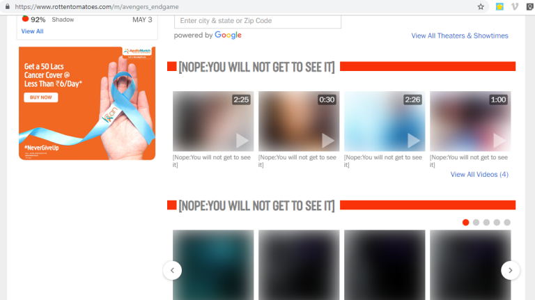

# Avengers Endgame Spoiler : You will not get to see it

This Chrome extension will save you from reading any Avengers Endgame Spoilers.  

# How To Use?
- Clone this repository or download as a zip file
- Incase you downloaded as a zip, unzip it
- Open Google Chrome
- Go to `chrome://extensions`
- Click on `Load Unpacked` which you can see in the top left side.
- Select the path where you cloned/downloaded this project.
- An icon  should appear besides your Chrome Search bar.
- That's all :D Try opening any [Avengers Endgame Spoiler].

# Why this Chrome Extension exists?
When I created this extension, its purpose was:
- An attempt to save myself from Avengers Endgame spoilers
- To solve the problem of spoilers as a Software Developer
- To learn how to create kick-ass Chrome Extensions
